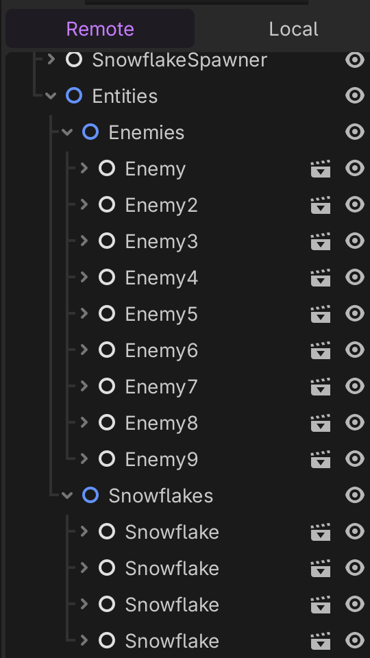

# Non-unique Snowflakes in Godot

This repo demonstrates an issue in Godot where nodes are instantiated with the same name:



The offending code is in [snowflake_spawner](scenes/main/snowflake_spawner.gd):

- Unlike the [enemy_spawner](scenes/main/enemy_spawner.gd), which directly adds the instance to its spawn_destination, the snowflake_spawner waits for a signal from the autoloaded entities.gd.
- Upon receiving the signal, the node is added to the tree.
- Removing `if entity is Snowflake:` will spawn non-uniquely named Enemy nodes as well.

Output shows Snowflakes have unique IDs but the same name:

```
Snowflake 40433092097 added to scene
entity_instances: [Enemy:<Node2D#38352717275>, Enemy2:<Node2D#39141246436>, Snowflake:<Node2D#39174800870>, Enemy3:<Node2D#39208355306>, Enemy4:<Node2D#39241909740>, Snowflake:<Node2D#39275464174>, Enemy5:<Node2D#39309018608>, Enemy6:<Node2D#39342573042>, Snowflake:<Node2D#39376127476>, Enemy7:<Node2D#39409681910>, Enemy8:<Node2D#40298874360>, Snowflake:<Node2D#40332428795>, Enemy9:<Node2D#40365983229>, Enemy10:<Node2D#40399537663>, Snowflake:<Node2D#40433092097>]

```